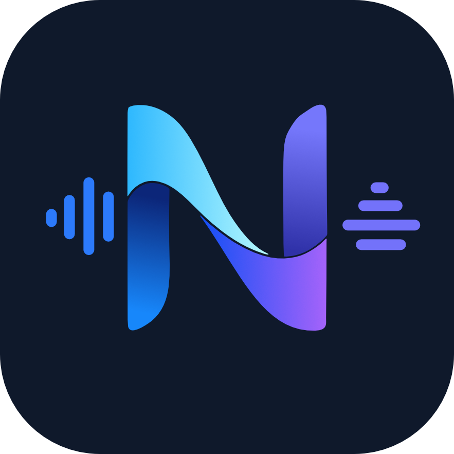
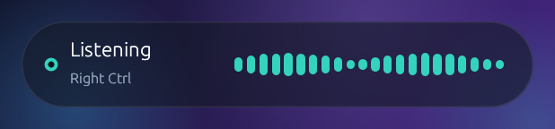
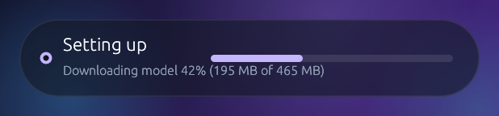
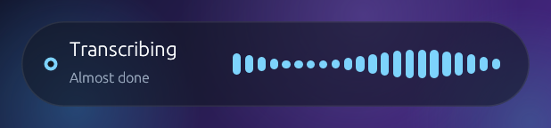
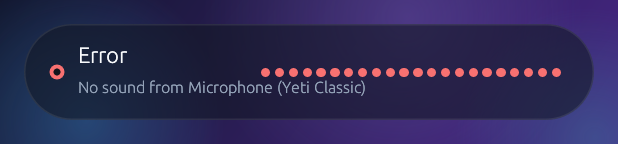

<div align="center">



# Noma

**Local push-to-talk dictation for Windows.**

Hold a key, speak, release. The words land where your cursor is.
Nothing leaves the machine.

[](https://github.com/meekyphotos/project-noma/actions/workflows/build.yml)
[](https://github.com/meekyphotos/project-noma/releases/tag/nightly)
[](LICENSE)



</div>

Transcription is NVIDIA **Parakeet TDT 0.6B**, running locally through
[sherpa-onnx](https://github.com/k2-fsa/sherpa-onnx). On CPU it decodes a
3.85 s clip in 0.14 s — about **27x faster than real time** — so a GPU is
optional and a dictation comes back before you have finished letting go of the
key.

---

## Download

Grab the newest build from the [releases page](https://github.com/meekyphotos/project-noma/releases),
unzip it anywhere, and run `noma.exe`. Nothing needs installing: sherpa-onnx,
ONNX Runtime and the Visual C++ runtime all ship inside the zip. The Parakeet
model (~465 MB) is fetched on first launch.

| Build | What it is |
|---|---|
| A `v*` release | A fixed version that never changes |
| `nightly` | The newest commit on `main`, rebuilt on every push |
| An Actions artifact | The build for one specific commit, kept 30 days |

## Using it

1. A teal tray icon appears.
2. Wait for the overlay to stop saying **Setting up**.
3. Click into any text field, hold **Right Ctrl**, speak, release.
4. The words appear at the cursor.
5. **Quit** from the tray.

Right Ctrl is swallowed while Noma runs, so it never acts as a modifier in
other apps.

<div align="center">



</div>

---

## Setup for a coding agent

Deterministic steps, each with something you can check. Windows 11 x64 only —
the hotkey hook and the overlay are Win32.

### 1. Prerequisites

| Needed for | Verify with | If missing |
|---|---|---|
| Compiling | `rustc --version` (1.75+) | <https://rustup.rs> |
| Linking | `rustc -vV` prints `host: x86_64-pc-windows-msvc` | VS Build Tools, "Desktop development with C++" |
| `bindgen` | `Test-Path "C:\Program Files\LLVM\bin\libclang.dll"` | `winget install LLVM.LLVM` |

`libclang` is not optional. `sherpa-rs-sys` generates its bindings at build
time and the published crate ships none, so a missing `libclang.dll` fails the
build with no fallback. If it lives somewhere unusual, set `LIBCLANG_PATH` to
the directory containing it.

Nothing else is required. The sherpa-onnx libraries are vendored in this repo,
so the build makes no network calls beyond crates.io.

### 2. Build

```bash
git clone https://github.com/meekyphotos/project-noma
cd project-noma
cargo build --release -p noma
```

Expect `Finished` on the release profile. A cold build takes 10-30 minutes;
most of that is `eframe` and `wgpu`.

### 3. Verify without a microphone or the model

```bash
cargo test --workspace
```

Expect **92 passed**, 5 ignored. The ignored suites need real hardware or the
model download; see [Tests](#tests).

```bash
cargo run -p noma -- --fake
```

Starts the whole app with a placeholder transcriber, so the tray, overlay and
hotkey can be exercised with no model present.

### 4. First real run

```bash
cargo run -p noma
```

This downloads ~465 MB into `%LOCALAPPDATA%\noma\models`, showing progress in
the overlay. Success looks exactly like this on stderr:

```
noma: hold Right Ctrl to talk
noma: microphone is Microphone (Yeti Classic)
noma: Parakeet on cpu ready
```

If the microphone named there is not the one you intend to speak into, fix that
before anything else — see [Microphone](#microphone). It is the most common
reason dictation appears to do nothing at all.

### 5. Things that will surprise an automated caller

- **Dictation cannot be driven by synthetic keystrokes.** The low-level hook
  deliberately ignores injected input (`LLKHF_INJECTED`), so `SendKeys`,
  `keybd_event` and friends will not start a recording. A human has to hold the
  key. Everything either side of that is scriptable.
- **It is a tray app.** There is no window at startup; the overlay appears only
  when something is happening and parks itself off-screen otherwise.
  `--preview <listening|transcribing|loading|error>` pins it on screen for
  inspection or screenshots.
- **It never exits on its own.** Quit from the tray, or terminate the process.
- **Two diagnostics ship with it**, both of which print and exit:

  ```bash
  cargo run -p noma-audio --example devices   # which mics exist, which is used
  cargo run -p noma-audio --example levels    # what each one is actually hearing
  ```

---

## Settings

`%APPDATA%\noma\settings.toml`, written on first run and read at startup. A
file that fails to parse is moved to `settings.toml.invalid` rather than
overwritten.

```toml
model = "sherpa-onnx-nemo-parakeet-tdt-0.6b-v3-int8"
provider = "cpu"          # cpu | cuda | directml
threads = 8
hotkey = "right-ctrl"     # right-ctrl | right-alt | right-shift | caps-lock | f13
microphone = ""           # substring of a device name; empty = Windows default
paste-mode = "paste"      # paste (Ctrl+V) | type (synthesized keystrokes)
hud-opacity = 0.6         # 0.0 fully see-through, 1.0 solid
partials = true           # decode while the key is held
partial-interval-ms = 700
history-limit = 200       # 0 turns history off entirely

[text]
enabled = true
spoken-commands = true
remove-fillers = true
fillers = ["um", "uh", "uhm", "erm", "eh", "mm", "hmm", "mhm"]
capitalize-sentences = true
ensure-final-punctuation = false

[[text.replacements]]
from = "no ma"
to = "Noma"
```

### Models

| Id | What it is |
|---|---|
| `sherpa-onnx-nemo-parakeet-tdt-0.6b-v3-int8` | 25 European languages, punctuated (default) |
| `sherpa-onnx-nemo-parakeet-tdt-0.6b-v2-int8` | English only, a little sharper on English |

Both punctuate and capitalize on their own, which is why the text stage does
not try to.

### Microphone

Empty means Noma follows the Windows default input, resolved fresh on every key
press, so changing the default takes effect on the next dictation without a
restart.

That default is not always the mic you are speaking into. A wireless headset
that is off or on its charger still registers as a perfectly healthy device and
records digital silence, which looks exactly like Noma ignoring you. Pin one
instead:

```toml
microphone = "yeti"       # matches "Microphone (Yeti Classic)"
```

Matching is a case-insensitive substring, with an exact name winning over a
partial one, so a short name is enough and it survives Windows renumbering a
device to `2- Arctis Nova Pro Wireless`. An unmatched name falls back to the
default rather than refusing to record, and says so on stderr.

### Spoken commands

Said out loud, these become characters: `new line`, `new paragraph`,
`question mark`, `exclamation mark`, `semicolon`, `ellipsis`. Deliberately
absent are "period" and "comma" — Parakeet punctuates on its own, and dictating
a sentence containing the word "period" is far likelier than wanting a bare full
stop.

A phrase only counts when the model decoded it bare, so "a new. line" stays
literal.

---

## How it works

| Crate | Role |
|---|---|
| `noma` | Binary: wires the loop, loads the model in the background |
| `noma-hotkey` | Global hold-to-talk, one of five bindable keys |
| `noma-audio` | Mic capture, waveform peaks, band-limited resampling to 16 kHz |
| `noma-asr` | `AsrEngine` trait, Parakeet engine, and a slot for "not loaded yet" |
| `noma-model` | Model registry, download with progress, unpack |
| `noma-text` | Fillers, spoken commands, custom vocabulary, capitalization |
| `noma-config` | `settings.toml` and the dictation history |
| `noma-inject` | Clipboard + Ctrl+V, or synthesized typing |
| `noma-hud` | Transparent overlay, tray, history window |

ASR sits behind a trait, so Whisper.cpp can be added later for languages
Parakeet does not cover without touching the app.

### Vendored libraries

`vendor/sherpa-onnx/lib` holds the sherpa-onnx and ONNX Runtime binaries, about
15 MB, and `.cargo/config.toml` points `SHERPA_LIB_PATH` at them.

They are checked in rather than downloaded because `sherpa-rs-sys` otherwise
fetches them into a cache under `%LOCALAPPDATA%` and hands cargo linker flags
pointing there. Cargo then caches those flags and will not re-run the build
script unless its fingerprint changes, so clearing that cache breaks the build
with `LNK1181: cannot open input file 'cargs.lib'` instead of fetching them
again. Vendoring makes the build hermetic and that failure impossible.

Exporting `SHERPA_LIB_PATH` yourself still overrides it, which is how you would
point a build at a CUDA or DirectML build of sherpa-onnx.

### The overlay is genuinely transparent

Windows will not do this for you. Setting `DWMWA_SYSTEMBACKDROP_TYPE` to
acrylic looks like the right call and is the opposite: DWM paints that material
across the whole window rect *underneath* the app's own pixels, so every
transparent pixel shows material instead of the desktop. Worse, the overlay is
deliberately never activated — it must not steal focus from whatever you are
dictating into — and Windows degrades acrylic on a deactivated window to a flat
solid colour. The result was an opaque grey slab that looked like a bug and was
in fact the documented behaviour.

`with_transparent(true)` and a system backdrop are mutually exclusive
intentions: winit implements transparency by marking the client area
DWM-transparent, which is precisely the condition that lets a backdrop paint
beneath it. Noma therefore asks for `DWMSBT_NONE` and paints its own
translucency, tuned with `hud-opacity`. Below about 0.35 the subtitle starts to
disappear over a busy background.

### Partial results

With `partials = true`, Noma re-decodes the whole buffer every ~700 ms while the
key is held and shows the text in the overlay. Parakeet has no streaming mode,
so this is repeated offline decoding rather than true streaming: the interval
adapts to how long a pass takes, one decode runs at a time, and passes stop
after 30 seconds of held audio so they never delay the final result. Set
`partials = false` for the lowest possible latency on release.

### GPU

The default build is CPU, and fast enough that a GPU is optional — see the
numbers at the top. `provider = "cuda"` or `"directml"` additionally needs
sherpa-onnx built with that backend:

```bash
cargo build -p noma --features cuda
```

That compiles sherpa-onnx from source (CMake, MSVC, and a CUDA toolkit matching
the ONNX Runtime build) instead of using the vendored libraries, and takes
considerably longer. Setting `provider` without the matching feature falls back
to CPU inside ONNX Runtime.

---

## Tests

```bash
cargo test --workspace
```

Two suites are ignored by default because they need hardware or the model. End
to end against the real model, in English, German, French and Spanish:

```bash
cargo test -p noma-asr --test parakeet -- --ignored --nocapture
```

Microphone capture, snapshotting and resampling against the real input device:

```bash
cargo test -p noma-audio --test capture -- --ignored --nocapture
```

## Releasing

`.github/workflows/build.yml` builds on Windows for every push and pull request,
runs the tests, and packages `noma.exe` with its DLLs.

Pushing to `main` refreshes the rolling `nightly` prerelease in place, so that
download URL always points at the head of the branch. A build is also attached
to every run as an artifact, including for pull requests.

To cut a version, bump `version` in the workspace `Cargo.toml`, commit, then tag:

```bash
git tag v0.2.0 && git push origin v0.2.0
```

The workflow refuses to publish if the tag disagrees with `Cargo.toml`, so the
two cannot drift apart.

Two details the packaging step guards, because both produce a build that looks
fine and then fails on someone else's machine: `noma.exe` links
`sherpa-onnx-c-api.dll` and cannot start without it, and `onnxruntime.dll`
imports a Visual C++ runtime that a clean Windows install does not have. Both
are bundled, and the build fails loudly if either is missing.

## Next

- Streaming partials that decode incrementally instead of re-decoding
- Optional LLM cleanup pass for stutters and restarts
- macOS (Accessibility + CoreML/Metal)
- Settings UI, installer, dictation commands
